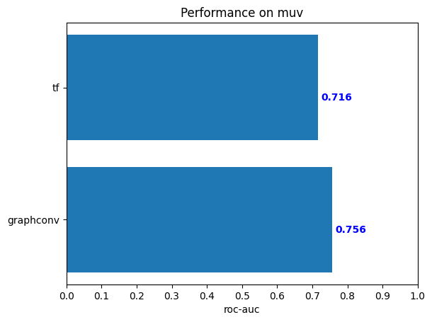

# deepchem MUV

## Install dependence:
```shell
python3 -m pip install rdkit-pypi
```
Other dependences may includes: tensorflow, pytorch, scikit-learn

## Run method:
```
python3 train_muv.py
```

## Result
The result should be something like:


